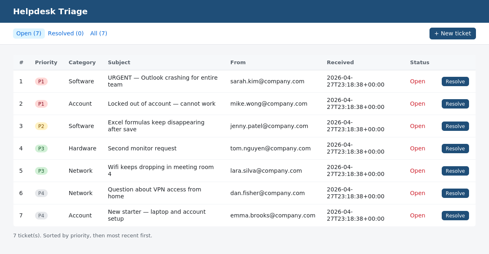

# Helpdesk Email Triage Tool

A small Python application that simulates the work an IT service-desk
technician does when emails land in a shared mailbox: parse incoming
messages, classify them by category, assign a priority, store them in
a database, and surface them through a simple web UI.

This is a learning project. It's the Python version of a problem I first
hit at IKEA Logistics in 2017, where I was a Quality Coordinator drowning
in incoming emails with photo attachments and wrote a VBA macro to batch
them. After completing my Master of IT at La Trobe University, I rebuilt
the same idea from scratch with the tools I learned during the degree.



## What it does

1. **Parse** an email-style message into structured fields (sender, subject, body)
2. **Classify** the request into one of: *Account / Hardware / Software / Network / Other*
3. **Assign a priority** (P1 / P2 / P3 / P4) using simple keyword rules — with
   negation handling so "**not** urgent" doesn't trigger a P1 alarm
4. **Store** the ticket in a local SQLite database
5. **Display** all tickets in a small Flask web UI, sorted by priority then date,
   with a single-click *Resolve* action

## Why I built it this way

A few design choices worth calling out:

- **Rule-based, not ML.** Service-desk classification has to be explainable
  to a human supervisor. Every decision the triage engine makes can be
  traced back to a single keyword in `triage.py`.
- **Negation handling.** The very first version of the classifier flagged
  a ticket containing "**not** urgent" as P1. I added a small negation
  filter and a regression test so it doesn't happen again — the test
  is in `test_triage.py::test_not_urgent_is_not_treated_as_p1`.
- **Separated concerns.** `triage.py` (classification rules) is independent
  of `app.py` (database + Flask). That means I can unit-test the triage
  logic without spinning up a database or a web server.
- **No raw SQL strings scattered around.** All database access is in `app.py`
  with parameterised queries — no risk of SQL injection from user input.

## Stack

- **Python 3.12**
- **Flask** for the web UI
- **SQLite** as the local database (zero-setup, file-based)
- **Jinja2** templates for the HTML pages
- **pytest** for unit testing the triage rules

No machine-learning libraries, no external services — everything runs
locally with `pip install -r requirements.txt`.

## Quick start

```bash
# 1. Clone and enter the repo
git clone https://github.com/JeZHA32/helpdesk-triage-tool.git
cd helpdesk-triage-tool

# 2. Install dependencies (a virtualenv is recommended)
python -m venv venv
source venv/bin/activate            # on Windows: venv\Scripts\activate
pip install -r requirements.txt

# 3. Initialise the database and load 7 sample emails
python app.py init
python app.py seed

# 4. Either browse the data on the command line...
python app.py list

# ...or start the web UI
python app.py serve
# then open http://127.0.0.1:5000 in your browser
```

## Sample output (CLI)

```
[P1] #  1 Software   OPEN     URGENT — Outlook crashing for entire team
[P1] #  2 Account    OPEN     Locked out of account — cannot work
[P2] #  3 Software   OPEN     Excel formulas keep disappearing after save
[P3] #  4 Hardware   OPEN     Second monitor request
[P3] #  5 Network    OPEN     Wifi keeps dropping in meeting room 4
[P4] #  6 Network    OPEN     Question about VPN access from home
[P4] #  7 Account    OPEN     New starter — laptop and account setup
```

## Running the tests

```bash
pytest -v
```

13 tests cover email parsing, category rules, priority rules, and the
negation-handling regression case. All pass on a fresh checkout.

## Repository layout

```
helpdesk-triage-tool/
├── app.py                  # Flask app, database access, CLI entry point
├── triage.py               # Email parser + classification rules (pure functions)
├── test_triage.py          # pytest tests for triage.py
├── requirements.txt        # Flask, pytest
├── templates/
│   ├── index.html          # Ticket list view
│   └── submit.html         # New-ticket form
├── data/
│   └── sample_emails/      # 7 example emails for `python app.py seed`
└── README.md
```

## What I'd do next

Honest list of things this project doesn't do that a real service-desk
tool would:

- Pull from a real mailbox via Microsoft Graph or IMAP, instead of reading
  pasted text
- Authentication and per-agent ticket assignment
- SLA tracking with target resolution times per priority
- Dashboard view (open tickets per category, average resolution time, etc.)
- Replace the keyword rules with a small classifier trained on labelled
  ticket data — useful once there's enough volume to learn from

These are the things I'd build in if I were doing this in a real role
rather than as a portfolio project.

## About me

I'm Jerry — a Master of IT (Software Engineering) graduate from La Trobe
University, based in Melbourne. I'm transitioning into IT support /
junior development roles after five years of customer-facing work at
Crown Resorts. [LinkedIn](https://www.linkedin.com/in/jerry-zhao-208b511ba/).
